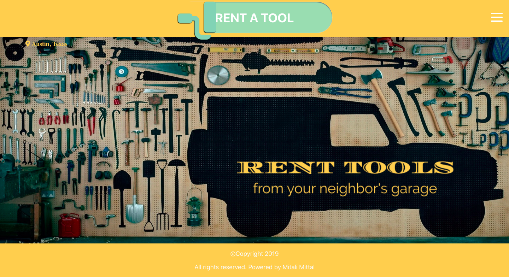
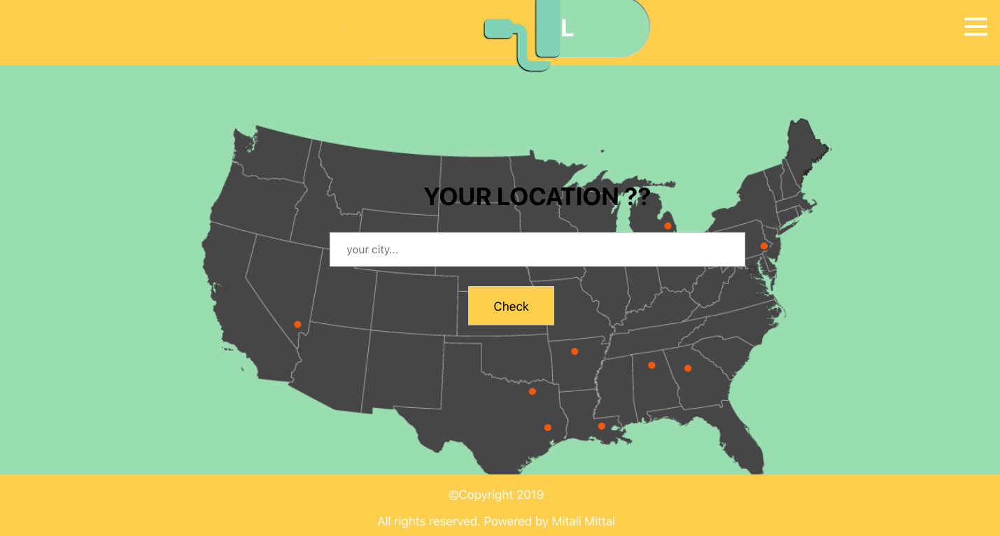

# RENT A TOOL

A user want to do something around house, but don’t have a big enough ladder to do it. Or want to clean garage and patio, but no pressure washer. Instead of buying it and finding a place to store it for the next time user going to need it, what if user can rent it out to other neighbors who can benefit from them and simultaneously earn money in the process.

### How to use it

* Fork and Clone this repository.
* Run `npm install` command into the source folder.
* Run `npm start` command into the frontend folder to start the server.
* Run `nodemon server.js` command into the backend folder to start the server.

### How it was made

* We used PostgreSQL, Express, and Knex to put together the database, server, and         routing, ie. backend
* For security we used bcrypt and Crypto.
* For the frontend, we used React and core Redux to render our page.
* For fetching the location, we used google maps.

### TECHNOLOGIES

* React - Redux
* Postgress
* Node js
* Knex

